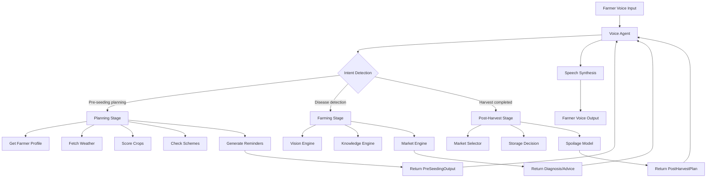

# Farm Management Module - Complete Documentation

## Module Overview

The **Farm Management** module is the core backend logic for managing all stages of agriculture lifecycle for the KisaanMitra voice-first farming assistant. It is divided into three main stages that correspond to the agricultural workflow:

1. **Planning Stage** (Pre-Seeding)
2. **Farming Stage** (Cultivation)
3. **Post-Harvest Stage** (Marketing & Storage)

### Purpose

Provides comprehensive agricultural guidance from crop planning through harvest and market selling, optimized for voice-first interaction in multiple Indian languages (Hindi/English).

### Module Structure

```
farm_management/
├── __init__.py
├── planning_stage/          # Pre-seeding crop planning & schemes
├── farming_stage/           # Active cultivation support
└── post_harvest_stage/      # Marketing & storage optimization
```

---

## 1. Planning Stage Module

**Path**: `Backend/farm_management/planning_stage/`

### Purpose

Helps farmers make informed pre-seeding decisions by:
- Recommending suitable crops based on soil, weather, and season
- Checking eligibility for government schemes
- Generating deadline reminders
- Providing procurement sources for seeds/materials

### Architecture

```
planning_stage/
├── models.py              # Pydantic data models
├── constants.py           # Enums and configuration constants
├── service.py             # Main orchestration service
├── engines/               # Business logic engines
│   ├── crop_recommendation.py
│   ├── scheme_engine.py
│   ├── weather_engine.py
│   ├── reminder_engine.py
│   └── response_builder.py
└── repositories/          # Data access layer
    ├── farmer_repo.py
    ├── crop_repo.py
    ├── scheme_repo.py
    └── reminder_repo.py
```

---

### Core Files

#### 1.1 `models.py` - Data Models

Defines all Pydantic models for type-safe data handling.

**Key Models**:

##### **FarmerProfile**
```python
class FarmerProfile(BaseModel):
    farmer_id: str
    language: Language = Language.HINDI
    location: Location
    soil_type: SoilType
    irrigation_type: IrrigationType
    land_size_acres: float
    farmer_type: Optional[FarmerType] = None
    
    def compute_farmer_type(self) -> FarmerType:
        # Auto-computes: MARGINAL (<2.5), SMALL (<5), MEDIUM (<25), LARGE (>25 acres)
```

**Purpose**: Stores complete farmer profile including location, land details, and agricultural infrastructure.

##### **PlanningRequest**
```python
class PlanningRequest(BaseModel):
    farmer_id: str
    season: Optional[Season] = None  # Auto-detected if missing
    risk_preference: RiskPreference = RiskPreference.BALANCED
    budget_level: Optional[str] = None
```

**Purpose**: Input model for pre-seeding planning requests.

##### **EnvironmentalContext**
```python
class EnvironmentalContext(BaseModel):
    temperature_c: float
    humidity_pct: float
    rain_forecast: bool
    rain_mm_next_7_days: float
    wind_speed_mps: float
    alerts: List[str] = Field(default_factory=list)
```

**Purpose**: Weather and environmental conditions for crop recommendations.

##### **CropRecord**
```python
class CropRecord(BaseModel):
    crop_key: str
    crop_name: str
    crop_name_hi: Optional[str] = None
    seasons: List[Season]
    suitable_soils: List[SoilType]
    irrigation_supported: List[IrrigationType]
    climate: ClimateRange
    maturity_days_min: int
    maturity_days_max: int
    profit_level: ProfitLevel
    market_demand: MarketDemand
    risks: List[str]
    requirements: CropRequirements
    procurement_sources: List[ProcurementSource]
```

**Purpose**: Comprehensive crop encyclopedia entry with all cultivation details.

##### **CropRecommendation**
```python
class CropRecommendation(BaseModel):
    crop_key: str
    crop_name: str
    crop_name_hi: Optional[str] = None
    score: float = Field(..., ge=0, le=100)  # 0-100 suitability score
    profit_level: ProfitLevel
    reasons: List[str]  # Why recommended
    risks: List[str]    # Potential risks
    crop_requirements: CropRequirements
    seed_material_sources: List[ProcurementSource]
    sowing_window_hint: Optional[str] = None
    next_best_action: Optional[str] = None
```

**Purpose**: Scored crop recommendation with actionable guidance.

##### **SchemeRecord**
```python
class SchemeRecord(BaseModel):
    scheme_key: str
    scheme_name: str
    scheme_name_hi: Optional[str] = None
    description: str
    benefits: List[str]
    deadline: Optional[datetime] = None
    docs_required: List[str]
    eligibility_rules: Dict[str, Any]  # e.g., {"min_land_acres": 2.5, "farmer_types": ["marginal", "small"]}
    states_eligible: Optional[List[str]] = None
    crops_eligible: Optional[List[str]] = None
    apply_url: Optional[str] = None
    csc_applicable: bool = True
```

**Purpose**: Government scheme encyclopedia with eligibility criteria.

##### **SchemeEligibilityResult**
```python
class SchemeEligibilityResult(BaseModel):
    scheme_key: str
    scheme_name: str
    eligible: bool
    why_eligible: List[str]
    why_not_eligible: List[str]
    deadline_warning: Optional[str] = None
    docs_required: List[str]
    next_step: str  # Actionable guidance
    apply_url: Optional[str] = None
```

**Purpose**: Detailed scheme eligibility check result with reasoning.

##### **ReminderRecord**
```python
class ReminderRecord(BaseModel):
    farmer_id: str
    scheme_key: str
    scheme_name: str
    reminder_datetime: datetime
    message: str
    message_hi: Optional[str] = None
    status: ReminderStatus = ReminderStatus.PENDING
```

**Purpose**: Deadline reminder for scheme applications.

##### **PreSeedingOutput**
```python
class PreSeedingOutput(BaseModel):
    header: str
    header_hi: Optional[str] = None
    language: Language
    speech_text: str  # Concise voice-first output
    speech_text_hi: Optional[str] = None
    weather_summary: str
    weather_summary_hi: Optional[str] = None
    crop_cards: List[CropRecommendation]
    scheme_cards: List[SchemeEligibilityResult]
    reminders: List[ReminderRecord]
    detailed_reasoning: Optional[str] = None
    urgency_level: UrgencyLevel = UrgencyLevel.MEDIUM
```

**Purpose**: Complete final output for UI/voice assistant.

---

#### 1.2 `constants.py` - Enums and Constants

Defines all enumerations and configuration values.

**Key Enums**:

- **Season**: `KHARIF` (June-Oct), `RABI` (Nov-Mar), `ZAID` (Mar-Jun), `YEAR_ROUND`
- **SoilType**: `ALLUVIAL`, `BLACK`, `RED`, `LATERITE`, `DESERT`, `MOUNTAIN`, `CLAY`, `LOAMY`, `SANDY`
- **IrrigationType**: `RAINFED`, `CANAL`, `TUBE_WELL`, `DRIP`, `SPRINKLER`, `MIXED`
- **FarmerType**: `MARGINAL` (<2.5 acres), `SMALL` (<5), `MEDIUM` (<25), `LARGE` (>25)
- **RiskPreference**: `SAFE`, `BALANCED`, `HIGH_PROFIT`
- **ProfitLevel**: `LOW`, `MEDIUM`, `HIGH`, `VERY_HIGH`
- **MarketDemand**: `LOW`, `MEDIUM`, `HIGH`, `VERY_HIGH`
- **Language**: `HINDI` ("hi"), `ENGLISH` ("en")
- **UrgencyLevel**: `LOW`, `MEDIUM`, `HIGH`, `CRITICAL`
- **ReminderStatus**: `PENDING`, `SENT`, `CANCELLED`

**Key Constants**:

```python
# Crop scoring weights (total: 100)
CROP_SCORING_WEIGHTS = {
    "SOIL_MATCH": 30,
    "SEASON_MATCH": 25,
    "RAINFALL_FIT": 15,
    "TEMPERATURE_FIT": 10,
    "IRRIGATION_MATCH": 10,
    "PROFIT_PREFERENCE": 10,
}

# Reminder intervals (days before deadline)
REMINDER_DAYS = [15, 7, 1]

# Season month mappings
SEASON_MONTHS = {
    Season.KHARIF: [6, 7, 8, 9, 10],
    Season.RABI: [11, 12, 1, 2, 3],
    Season.ZAID: [3, 4, 5, 6],
}

# Default weather fallback
DEFAULT_WEATHER = {
    "temperature_c": 28.0,
    "humidity_pct": 65.0,
    "rain_forecast": False,
    "rain_mm_next_7_days": 15.0,
    "wind_speed_mps": 3.5,
    "alerts": ["Using simulated weather data for demo"]
}
```

---

#### 1.3 `service.py` - Main Service Orchestrator

**Class**: `PreSeedingService`

**Purpose**: Single entry point that orchestrates all planning stage operations.

**Key Methods**:

##### `__init__()`
```python
def __init__(
    self,
    farmer_repo: Optional[FarmerRepository] = None,
    crop_repo: Optional[CropRepository] = None,
    scheme_repo: Optional[SchemeRepository] = None,
    reminder_repo: Optional[ReminderRepository] = None,
    weather_api_key: Optional[str] = None
)
```

Initializes all repositories and engines. Creates default instances if not provided.

##### `run(request: PlanningRequest) -> PreSeedingOutput`

**Workflow**:
1. **Fetch farmer profile** from FarmerRepository
2. **Detect season** (auto or from request)
3. **Get weather context** via WeatherEngine
4. **Score all crops** using CropRecommendationEngine
5. **Check scheme eligibility** via SchemeEngine
6. **Generate reminders** for scheme deadlines
7. **Save reminders** to ReminderRepository
8. **Build final output** via ResponseBuilder

**Returns**: Complete `PreSeedingOutput` with crops, schemes, and reminders.

---

### Engines (Business Logic)

#### 1.4 `engines/crop_recommendation.py`

**Class**: `CropRecommendationEngine`

**Purpose**: Multi-factor crop scoring and recommendation.

**Key Method**: 
##### `recommend(request, farmer, env, crops, season) -> List[CropRecommendation]`

**Scoring Algorithm** (out of 100 points):

1. **Soil Match** (30 pts): Checks if farmer's soil in `crop.suitable_soils`
2. **Season Match** (25 pts): Checks if season in `crop.seasons`
3. **Rainfall Fit** (15 pts): Compares 7-day forecast to `crop.climate.rain_min/max_mm`
4. **Temperature Fit** (10 pts): Compares current temp to `crop.climate.temp_min/max_c`
5. **Irrigation Match** (10 pts): Checks if farmer's irrigation in `crop.irrigation_supported`
6. **Profit Preference** (10 pts): Boosts high-profit crops based on `risk_preference`

**Risk Penalty**: Deducts 5-15 points based on crop risks and risk preference.

**Returns**: Top 5 crops sorted by score (descending).

**Significant Functions**:
- `_score_crop()`: Computes total score + reasons + risks
- `_score_soil_match()`: Exact match = full points, compatible = 70%, else 0
- `_score_season_match()`: In season = full points, off-season = 0
- `_score_rainfall_fit()`: Within range = full, slightly off = partial, way off = 0
- `_calculate_risk_penalty()`: Adjusts based on risk_preference

---

#### 1.5 `engines/scheme_engine.py`

**Class**: `SchemeEngine`

**Purpose**: Check scheme eligibility and generate actionable guidance.

**Key Methods**:

##### `recommend_schemes(farmer, recommended_crops, all_schemes) -> List[SchemeEligibilityResult]`

Checks all schemes and returns eligible first, sorted by deadline urgency.

##### `check_eligibility(farmer, scheme, crop_keys) -> SchemeEligibilityResult`

**Eligibility Checks**:
1. **State**: If `scheme.states_eligible` is set, farmer's state must be in list
2. **Land Size**: Checks `eligibility_rules["min_land_acres"]`
3. **Farmer Type**: Checks `eligibility_rules["farmer_types"]`
4. **Irrigation**: Checks `eligibility_rules["irrigation_type"]`
5. **Crop**: If `scheme.crops_eligible` set, at least one planned crop must match
6. **Deadline**: Marks ineligible if deadline passed
7. **Special Requirements**: Notes KCC, crop enrollment, etc.

**Returns**: Detailed eligible/not-eligible status with reasons and actionable next step.

---

#### 1.6 `engines/weather_engine.py`

**Class**: `WeatherEngine`

**Purpose**: Fetch weather data with robust fallback.

**Key Method**: 
##### `get_context(lat, lon) -> EnvironmentalContext`

**Workflow**:
1. Try OpenWeather API if `api_key` provided
2. Fetch current weather + 7-day forecast
3. Calculate total rain in next 7 days
4. Parse alerts (temperature extremes, high wind, heavy rain)
5. Fallback to `DEFAULT_WEATHER` if API fails or unavailable

**Returns**: `EnvironmentalContext` with temperature, humidity, rain forecast, wind, and alerts.

---

#### 1.7 `engines/reminder_engine.py`

**Class**: `ReminderEngine`

**Purpose**: Generate multi-interval deadline reminders.

**Key Method**: 
##### `generate(scheme_results, farmer) -> List[ReminderRecord]`

**Workflow**:
1. Filter eligible schemes with deadlines
2. Extract days remaining from `deadline_warning`
3. For each scheme, create reminders at 15, 7, and 1 days before deadline
4. Skip reminders in the past
5. Generate bilingual messages (English + Hindi)

**Message Examples**:
- 15 days: "📌 PM-KISAN deadline in 15 days. Start preparing documents."
- 7 days: "🔔 Reminder: PM-KISAN deadline in 7 days. Apply soon."
- 1 day: "⚠️ Last day tomorrow! Apply for PM-KISAN scheme."

**Returns**: List of `ReminderRecord` to be saved.

---

#### 1.8 `engines/response_builder.py`

**Class**: `ResponseBuilder`

**Purpose**: Build final multilingual voice-first output.

**Key Method**: 
##### `build_output(farmer, weather, crops, schemes, reminders) -> PreSeedingOutput`

**Components Built**:

1. **Header**: Greeting (e.g., "🌾 Pre-Seeding Planning Report")
2. **Weather Summary**: Human-readable weather description
3. **Speech Text**: Concise 2-3 sentence voice output highlighting top crop and urgent schemes
4. **Detailed Reasoning**: Full text explanation of top crops and schemes
5. **Urgency Level**: Calculated from scheme deadlines (CRITICAL if <7 days, HIGH if <15, etc.)

**Supports**: Both English and Hindi via `language` parameter.

**Returns**: Complete `PreSeedingOutput`.

---

### Repositories (Data Access)

#### 1.9 `repositories/farmer_repo.py`

**Class**: `FarmerRepository`

**Purpose**: Manage farmer profile data.

**Current Implementation**: In-memory mock data with 5 sample farmers (F001-F005) across Punjab, Maharashtra, Karnataka, UP, Rajasthan.

**Key Method**:
- `get_farmer(farmer_id: str) -> FarmerProfile`: Returns farmer by ID or None

**Production**: Would connect to MongoDB `farmers` collection.

---

#### 1.10 `repositories/crop_repo.py`

**Class**: `CropRepository`

**Purpose**: Manage crop encyclopedia data.

**Current Implementation**: Comprehensive mock data with ~15 crops including rice, wheat, cotton, sugarcane, potato, tomato, onion, soybean, maize, bajra, etc.

**Each Crop Includes**:
- Suitable seasons, soils, irrigation types
- Climate requirements (temp/rain ranges)
- Maturity period, profit level, market demand
- Risks (pests, diseases, market volatility)
- Seed rates, fertilizers, water requirements
- Procurement sources (govt stores, dealers, online)

**Key Methods**:
- `list_crops() -> List[CropRecord]`: Returns all crops
- `get_crop(crop_key: str) -> CropRecord`: Returns specific crop

---

#### 1.11 `repositories/scheme_repo.py`

**Class**: `SchemeRepository`

**Purpose**: Manage government scheme data.

**Current Implementation**: Mock data with major schemes like PM-KISAN, PMFBY, Soil Health Card, Kisan Credit Card, etc.

**Key Method**:
- `list_schemes() -> List[SchemeRecord]`: Returns all schemes

---

#### 1.12 `repositories/reminder_repo.py`

**Class**: `ReminderRepository`

**Purpose**: Store and retrieve reminders.

**Current Implementation**: In-memory storage

**Key Methods**:
- `save_reminders(reminders: List[ReminderRecord])`: Saves reminders
- `get_pending_reminders(farmer_id: str) -> List[ReminderRecord]`: Gets pending reminders

---

## 2. Farming Stage Module

**Path**: `Backend/farm_management/farming_stage/`

### Purpose

Provides real-time support during active cultivation:
- Crop disease recognition via vision AI
- Pest/disease knowledge base queries
- Market price monitoring
- Weather-based farming guidance

### Architecture

```
farming_stage/
├── models.py              # Pydantic models for diseases, market prices
├── main_driver.py         # Main orchestration
├── engines/
│   ├── vision_engine.py      # Plant disease recognition (Keras model)
│   ├── knowledge_engine.py    # Pest/disease info retrieval
│   ├── market_engine.py       # Real-time market prices
│   └── weather_engine.py      # Weather guidance
└── models/
    └── plant_disease_recog_model_pwp.keras  # Pre-trained CNN model
```

### Core Components

#### 2.1 Vision Engine

**File**: `engines/vision_engine.py`

**Class**: `VisionEngine`

**Purpose**: Detect plant diseases from leaf images.

**Key Method**: `detect_disease(image_path: str) -> DiseaseDetectionResult`

**Workflow**:
1. Load pre-trained Keras model (`plant_disease_recog_model_pwp.keras`)
2. Preprocess image (resize, normalize)
3. Run inference
4. Return disease name, confidence, and recommended treatment

**Model**: CNN trained on PlantVillage dataset (~38 disease classes)

---

#### 2.2 Knowledge Engine

**File**: `engines/knowledge_engine.py`

**Class**: `KnowledgeEngine`

**Purpose**: Retrieve pest/disease information and treatment recommendations.

**Key Methods**:
- `get_disease_info(disease_name: str) -> DiseaseInfo`: Returns symptoms, causes, treatments
- `get_pest_info(pest_name: str) -> PestInfo`: Returns pest details and control measures

**Data Source**: Static knowledge base (can integrate with vector DB for RAG)

---

#### 2.3 Market Engine

**File**: `engines/market_engine.py`

**Class**: `MarketEngine`

**Purpose**: Fetch real-time commodity market prices.

**Key Method**: `get_prices(crop_name: str, state: str) -> List[MarketPrice]`

**Data Source**: Can integrate with govt APIs (e.g., Agmarknet) or use mock data

---

#### 2.4 Weather Engine

**File**: `engines/weather_engine.py`

**Class**: `WeatherEngine`

**Purpose**: Provide weather-based farming recommendations.

**Key Method**: `get_farming_advice(weather: EnvironmentalContext, crop: str) -> str`

**Examples**:
- High heat: "Increase irrigation frequency"
- Rain forecast: "Delay pesticide application"
- Strong wind: "Secure crop supports"

---

## 3. Post-Harvest Stage Module

**Path**: `Backend/farm_management/post_harvest_stage/`

### Purpose

Optimize post-harvest decisions:
- Market selection (where to sell for best price)
- Storage vs immediate sale decisions
- Transport cost optimization
- Spoilage risk modeling
- Profit maximization

### Architecture

```
post_harvest_stage/
├── models.py              # Harvest, market, storage models
├── core/
│   ├── engine.py          # Main orchestration engine
│   └── context.py         # Context aggregation
├── market/
│   ├── market_selector.py      # Select best market
│   ├── price_model.py          # Price prediction
│   ├── profit_calculator.py     # Net profit calculation
│   └── transport.py            # Transport cost/time
├── storage/
│   ├── storage_decision.py     # Store vs sell decision
│   ├── storage_options.py      # Available storage facilities
│   └── spoilage_model.py       # Spoilage risk prediction
├── data_access/
│   ├── crop_metadata.py        # Crop properties
│   ├── mandi_data.py           # Market/mandi data
│   └── storage_data.py         # Storage facility data
└── utils/
    ├── geo.py                  # Distance calculations
    ├── time.py                 # Date/time utilities
    └── units.py                # Unit conversions
```

### Core Components

#### 3.1 Main Engine

**File**: `core/engine.py`

**Class**: `PostHarvestEngine`

**Purpose**: Orchestrate all post-harvest analysis.

**Key Method**: `plan(harvest_context: HarvestContext) -> PostHarvestPlan`

**Workflow**:
1. Fetch crop metadata and market data
2. Calculate transport costs to all nearby mandis
3. Predict prices at each mandi
4. Evaluate spoilage risk if stored
5. Compare immediate sale vs storage options
6. Recommend optimal decision
7. Generate action steps

**Returns**: `PostHarvestPlan` with market recommendations, storage advice, and expected profits

---

#### 3.2 Market Selector

**File**: `market/market_selector.py`

**Class**: `MarketSelector`

**Purpose**: Find best market to sell produce.

**Key Method**: `select_best_markets(crop, location, quantity_kg, date) -> List[MarketOption]`

**Scoring Factors**:
- Current market price (highest priority)
- Transport cost and time
- Market demand/capacity
- Historical price volatility

**Returns**: Top 3 markets ranked by net profit (price - transport cost)

---

#### 3.3 Price Model

**File**: `market/price_model.py`

**Class**: `PriceModel`

**Purpose**: Predict future crop prices.

**Key Method**: `predict_price(crop, market, days_ahead: int) -> float`

**Approach**: Uses historical trends, seasonality, and current supply/demand (can integrate ML model)

---

#### 3.4 Storage Decision Engine

**File**: `storage/storage_decision.py`

**Class**: `StorageDecisionEngine`

**Purpose**: Decide whether to store or sell immediately.

**Key Method**: `evaluate_storage(crop, quantity_kg, current_price, storage_options) -> StorageDecision`

**Comparison**:
- **Immediate Sale**: Current price × quantity - transport cost
- **Storage**: Predicted future price × (quantity - spoilage loss) - storage cost - future transport cost

**Returns**: `SELL_NOW` or `STORE` with reasoning

---

#### 3.5 Spoilage Model

**File**: `storage/spoilage_model.py`

**Class**: `SpoilageModel`

**Purpose**: Predict crop spoilage over time.

**Key Method**: `predict_spoilage(crop, storage_type, duration_days, temp_c, humidity_pct) -> float`

**Factors**:
- Crop shelf life (varies by crop)
- Storage type (cold storage vs ambient)
- Temperature and humidity
- Duration

**Returns**: Percentage of crop lost (0-100%)

---

### Data Models

**Key Models** (from `models.py`):

```python
class HarvestContext(BaseModel):
    farmer_id: str
    crop_key: str
    quantity_kg: float
    quality_grade: str  # A, B, C
    harvest_date: datetime
    location: Location

class MarketOption(BaseModel):
    mandi_name: str
    mandi_location: Location
    distance_km: float
    current_price_per_kg: float
    predicted_price_7d: float
    transport_cost: float
    transport_time_hours: float
    net_profit: float
    arrival_demand: str  # HIGH, MEDIUM, LOW

class StorageOption(BaseModel):
    facility_name: str
    storage_type: str  # COLD, AMBIENT, WAREHOUSE
    capacity_available_kg: float
    cost_per_kg_per_month: float
    distance_km: float
    temperature_c: float
    humidity_pct: float

class PostHarvestPlan(BaseModel):
    recommendation: str  # "SELL_NOW" or "STORE"
    reasoning: str
    best_market_options: List[MarketOption]
    storage_options: List[StorageOption]
    immediate_sale_profit: float
    storage_estimated_profit: float
    action_steps: List[str]
```

---

## Module Interactions

### How Planning Stage → Farming Stage

1. **Planning Stage** outputs recommended crops via `CropRecommendation`
2. Farmer selects a crop and begins cultivation
3. **Farming Stage** receives `crop_key` and provides:
   - Disease detection when farmer uploads leaf photos
   - Pest/disease knowledge queries
   - Market price monitoring during growth
   - Weather-based daily guidance

**Integration Point**: `crop_key` from planning stage is used to filter knowledge and market data

---

### How Farming Stage → Post-Harvest Stage

1. **Farming Stage** tracks crop growth and maturity
2. When harvest is near/complete, farmer provides harvest details
3. **Post-Harvest Stage** receives:
   - `crop_key` (what was grown)
   - `quantity_kg` (how much harvested)
   - `quality_grade` (crop quality)
   - `harvest_date` and `location`
4. Returns optimal marketing/storage plan

**Integration Point**: Harvest triggers transition to post-harvest planning

---

### How All Stages Interact with Voice Agent

All three stages expose service classes that the **Voice Agent** module calls:

```python
# Voice Agent Integration
from farm_management.planning_stage.service import PreSeedingService
from farm_management.farming_stage.main_driver import FarmingStageDriver
from farm_management.post_harvest_stage.core.engine import PostHarvestEngine

# Planning stage call
planning_service = PreSeedingService()
output = planning_service.run(PlanningRequest(farmer_id="F001"))

# Farming stage call
farming_driver = FarmingStageDriver()
disease_result = farming_driver.analyze_plant_image(image_path)

# Post-harvest stage call
harvest_engine = PostHarvestEngine()
plan = harvest_engine.plan(harvest_context)
```

**Voice Agent** then converts structured outputs to natural language speech using the `ResponseBuilder` outputs and multilingual templates.

---

## Data Flow Summary



---

## Key Dependencies Between Modules

1. **Planning Stage depends on**:
   - Weather API (OpenWeather)
   - Farmer profiles (MongoDB in production)
   - Crop encyclopedia (MongoDB in production)
   - Government scheme data (APIs/scraping in production)

2. **Farming Stage depends on**:
   - Keras/TensorFlow for vision model
   - Knowledge base for pest/disease info
   - Market price APIs (Agmarknet, etc.)
   - Weather data

3. **Post-Harvest Stage depends on**:
   - Market/mandi data (Agmarknet, local mandi APIs)
   - Storage facility databases
   - Historical price data for predictions
   - Geolocation services for distance calculation

---

## API Endpoint Design Pattern

For each stage, recommended FastAPI endpoint structure:

```python
# Planning Stage
POST /api/v1/planning/recommend
Body: PlanningRequest
Response: PreSeedingOutput

# Farming Stage
POST /api/v1/farming/detect-disease
Body: {image: base64, crop_key: str}
Response: DiseaseDetectionResult

POST /api/v1/farming/get-advice
Body: {crop_key: str, issue: str}
Response: AdviceResponse

# Post-Harvest Stage
POST /api/v1/post-harvest/plan
Body: HarvestContext
Response: PostHarvestPlan
```

These endpoints will be implemented in the `Backend/api/` module, wrapping the service classes documented above.

---

## Summary of Significant Functions

### Planning Stage Top Functions
1. `PreSeedingService.run()` - Main orchestration
2. `CropRecommendationEngine.recommend()` - Crop scoring
3. `CropRecommendationEngine._score_crop()` - Multi-factor scoring algorithm
4. `SchemeEngine.check_eligibility()` - Scheme eligibility logic
5. `ReminderEngine.generate()` - Multi-interval reminder creation
6. `ResponseBuilder.build_output()` - Voice-first output formatting

### Farming Stage Top Functions
1. `VisionEngine.detect_disease()` - CNN inference for disease detection
2. `KnowledgeEngine.get_disease_info()` - Knowledge retrieval
3. `MarketEngine.get_prices()` - Real-time price fetching

### Post-Harvest Stage Top Functions
1. `PostHarvestEngine.plan()` - Complete post-harvest planning
2. `MarketSelector.select_best_markets()` - Profit-optimized market selection
3. `StorageDecisionEngine.evaluate_storage()` - Storage vs sell analysis
4. `SpoilageModel.predict_spoilage()` - Time-based spoilage prediction
5. `PriceModel.predict_price()` - Future price forecasting

---

## Usage Context for API Development

When creating API endpoints:

1. **Validate inputs** using Pydantic models from `models.py`
2. **Call service layer** (`PreSeedingService`, `PostHarvestEngine`, etc.)
3. **Handle errors** gracefully (farmer not found, API failures, etc.)
4. **Return structured responses** matching output models
5. **Support multilingual** outputs via `language` parameter
6. **Log operations** for debugging and analytics

The modules are designed with **separation of concerns**:
- **Models**: Data structures
- **Constants**: Configuration
- **Repositories**: Data access
- **Engines**: Business logic
- **Services**: Orchestration

This design makes it easy to:
- Test each component independently
- Replace mock data with real databases
- Add new engines without changing services
- Support both REST APIs and voice interfaces
