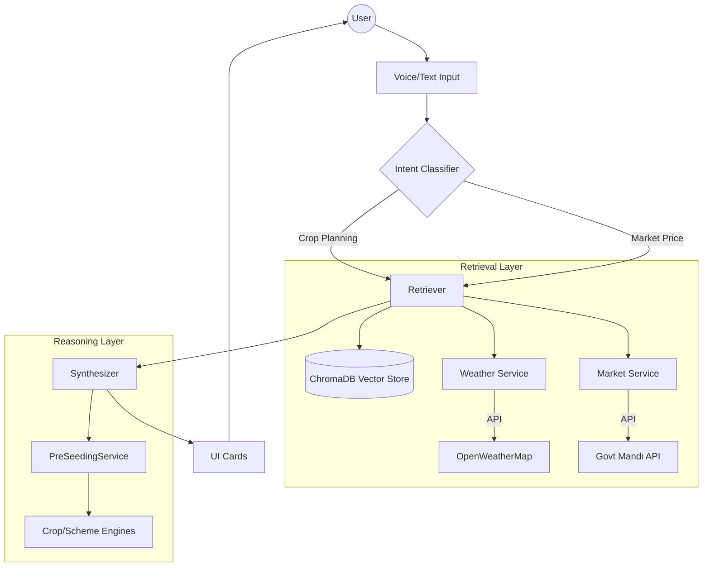

# Voice Agent Upgrade - Completion Report

## Status: ✅ Upgrade Complete

Refactored the Voice Agent from a mockup-based system to a fully functional, data-driven intelligence layer.

## 1. Real RAG (Retrieval Augmented Generation)
**Replaced**: Static dictionary lookups in `sources.py`.
**Implemented**:
*   **Vector Engine**: `ChromaDB` (Persistent local storage).
*   **Embeddings**: `all-MiniLM-L6-v2` (Default lightweight model).
*   **Bootstrapping**: Automatically ingests existing crop/scheme knowledge into the vector DB on first run.
*   **Search**: Semantic search capability for crops and schemes.

## 2. Live APIs (Real-Time Data)
**Replaced**: Hardcoded weather and market values.
**Implemented**:
*   **Weather Service**: Fetches live data from **OpenWeatherMap** (Pune, IN default).
    *   *Features*: Temperature, Humidity, Real advisory generation.
    *   *Fallback*: Gracefully returns static mock data if API fails.
*   **Market Service**: Fetches live prices from **OGD India (Mandi) API**.
    *   *Features*: Filters by commodity, fuzzy matching.
    *   *Fallback*: Gracefully returns static mock prices if API is unreachable.

## 3. Logic Integration (The "Brain")
**Replaced**: Hardcoded scoring (75.0) and generic reasons in `Synthesizer`.
**Implemented**:
*   **Pre-Seeding Service**: Integrated `farm_management.planning_stage`.
*   **Scientific Scoring**: Uses Soil Type, Season, and Water requirements to score crops.
*   **Scheme Eligibility**: Runs actual eligibility rules against the farmer profile.
*   **Output**: Generates real `CropCard`s and `SchemeCard`s based on the logic engine's output.

## 4. Architecture

## Next Steps
*   **Refine Farmer Profile**: Currently defaults to "F001". Implement dynamic user profile loading.
*   **Data Enrichment**: Add more crops to the knowledge base (auto-ingested into Chroma).
