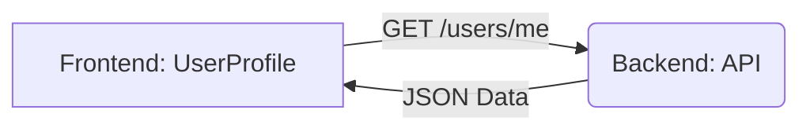

# Integration Skill

This skill assists in integrating a frontend application with a backend API (specifically FastAPI).

## Workflow

Follow these steps to complete the integration.

### 1. Analyze API (FastAPI)

- Scan the backend directory (defaulting to FastAPI).
- Locate `main.py` and any routers.
- list all available endpoints (GET, POST, PUT, DELETE).
- Identify Request and Response models for each endpoint.

### 2. Analyze Frontend

- Scan the frontend directory.
- Identify components and pages that require data integration.
- Locate existing API calls or placeholders.
- Determine the state management strategy (if any).

### 3. Map Endpoints to Frontend

- Create a strict mapping of which frontend component connects to which backend endpoint.
- Verify data types match between frontend interfaces and backend Pydantic models.

### 4. Create Integration Plan (Visual)

- Generate a high-level explanation plan.
- Use a textual representation of a visual diagram (e.g., Mermaid.js) to show the connection flow.

**Example Mermaid Diagram:**

- detailed the data flow.

### 5. Review and Approval

- **CRITICAL**: Present the mapped points and the Visual Plan to the User.
- **STOP** and wait for feedback and approval.
- Do not proceed to implementation until the user explicitly approves the plan.

### 6. Implementation

- Once approved, write the integration code.
- Update frontend services/api clients.
- Update backend CORS or other necessary configurations if needed.
- Ensure error handling is implemented.

### 7. Startup Instructions

- After implementation is complete, create a file named `instructions.md` in the root (or relevant folder).
- This file must contain:
    - Steps to start the Backend.
    - Steps to start the Frontend.
    - How to verify the integration works.
